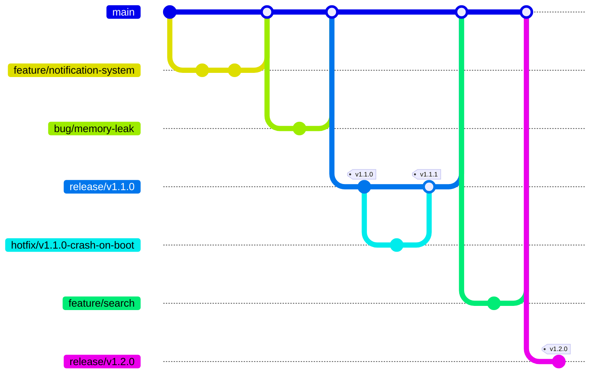

# Hit 分支策略與 Git Hub 操作手冊

<!-- 文件來源 metadata（由記錄者加上，非原文一部分） -->
> 📌 **文件來源**:本檔案完整記錄自 GitHub Issue [`hantoptw/Document-HitRD#1`](https://github.com/hantoptw/Document-HitRD/issues/1)（私有 repo）。
> - 原始標題:`[doc]-Hit 分支策略與 Git Hub 操作手冊`
> - 作者:`adminhitrd` ·  建立於:`2026-05-22` ·  標籤:`doc`
> - 擷取於:`2026-05-29`。內文逐字保留;13 張圖片已下載至 [`images/`](images/),原 `user-attachments` 連結改為本地相對路徑引用。

---

> **適用範圍**:採用 `main` 單一長期主幹、依版本從 `main` 切出 `release/v<X.Y.Z>` 發佈分支的模型。`main` 與所有 `release/v<X.Y.Z>` 皆為**受保護分支**(禁止直接 push,一律經 Pull Request)。
> 因目前我司尚無 repo 操作權限設定功能,任何操作前請自行審慎評估。
>
> **版本說明**:本 SOP 對應文件 1A v3.0「Release-Branch per Version」模型。
> v1.0 採雙向 Rebase 機制,已知雙胞胎 commit 與 Q3 重複衝突問題;
> v2.0 改採 `main` + `release` 雙長期分支 + PR-driven 雙向同步,消除雙胞胎與重複衝突;
> v3.0 在確認 develop 與 release **環境無差異**後,移除長期 `release` 分支:
> `release/v<X.Y.Z>` 於發佈時才從 `main` 切出並保留為該版本維護線;hotfix 在對應 release 分支上修正後,再將該 release 分支經 PR **併回 `main`**,使修正回到主幹。

---

## 目錄

1. [核心模型](#1-核心模型)
2. [命名與訊息規範(分支 / Tag / Commit message)](#2-命名與訊息規範分支--tag--commit-message)
3. [五大紀律](#3-五大紀律)
4. [專案初始化(Step 1–4)](#4-專案初始化step-14)
5. [日常開發流程(Step 5–11)](#5-日常開發流程step-511)
6. [發佈版本(Step 12)](#6-發佈版本step-12)
7. [Hotfix 與併回 main](#7-hotfix-與併回-main)
8. [角色與權限](#8-角色與權限)
9. [檢核清單(Checklist)](#9-建議-檢核清單checklist-可依個人工作習慣或git-操作熟練度進行調整)

---

## 1. 核心模型



> 圖中以 gitGraph 呈現分支拓樸與 tag:`feature/*` / `bug/*` 併入 `main`;發佈時從 `main` 切出 `release/v<X.Y.Z>` 分支並在其上打 `v<X.Y.Z>` tag;`hotfix/v<X.Y.Z>-*` 在對應 release 分支上修正,合併後打新的 patch tag(如 `v1.1.1`),隨後該 `release/v<X.Y.Z>` 分支經 PR **併回 `main`**,使修正回到主幹(圖中 `v1.2.0` 即從已含此修正的 `main` 切出)。
>
> 註:gitGraph 無法表達流程性註記(`rebase -i + FF`、`PR merge`)與 fast-forward 合併,本圖僅呈現分支與 tag 拓樸;完整操作流程見 §5 / §6 / §7。

> ⚠️ **核心鐵則 — 進入 `main` 與任何 `release/v<X.Y.Z>` 的整合一律透過 GitHub Pull Request**
> `main` 與所有 `release/*` 皆為受保護分支,**禁止直接 push**。`feature/* / bug/* / refactor/* / test/* / chore/* → main`、`hotfix/v*-* → release/v<X.Y.Z>`、以及 hotfix 後 `release/v<X.Y.Z> → main` 的**併回**,**一律走 PR**。本地**不執行**直接 push 至長期 / 發佈分支。

- **`main`** — 唯一長期主幹(即 develop),所有 feature/bug/refactor/test/chore 在此整合;受保護。
- **`release/v<X.Y.Z>`** — 發佈時從 `main` 切出的版本發佈分支,切出後**保留**為該版本維護線(非持續同步的長期分支);每個版本一條,受保護。因 develop 與 release 環境無差異,「發佈」即「從 main 切分支 + 打 tag」,不需 staging 同步分支。
- **`release/v<X.Y.Z>` 按版本而生、非長期主線** — 平時不與 `main` 同步;僅在 hotfix 後將該 release 分支併回 `main` 一次。版本退役後該分支可刪除。
- **Hotfix** — 從對應 `release/v<X.Y.Z>` 切 `hotfix/v<X.Y.Z>-<name>`,修完經 PR 回該 release 分支並打 patch tag;隨即將該 `release/v<X.Y.Z>` 分支經 PR **併回 `main`**(紀律 2),使修正回到主幹,後續從 `main` 切出的版本即自動帶有此修正。
- **歷史結構**:`main` 以 `git log --first-parent` 觀察主線;每條 `release/v<X.Y.Z>` 為 `main` 某時點的快照,加上該版本專屬的 hotfix。

---

## 2. 命名與訊息規範(分支 / Tag / Commit message)

### 2.1 分支

> **命名一致性**:除主幹 `main` 外,所有分支類別一律以 `<類別>/<說明>` 形式命名(category 與其後內容以 `/` 分隔);版本與精簡說明之間沿用 `-`(如 `hotfix/v1.1.0-crash-on-boot`)。

| 分支 | 命名 | 來源 | 終點 | Commit type | 生命週期 |
|---|---|---|---|---|---|
| 主幹(develop) | `main` | — | — | — | 長期・受保護 |
| 版本發佈分支 | `release/v<X.Y.Z>` | `main` | 切出後保留為版本維護線;hotfix 後經 PR 併回 `main` | — | 版本線・受保護 |
| 新功能 | `feature/<精簡說明>` | `main` | PR-merge 進 `main` | `[feat]` | 短期 |
| 缺陷修正 | `bug/<精簡說明>` | `main` | PR-merge 進 `main` | `[fix]` | 短期 |
| 內部重構 | `refactor/<精簡說明>` | `main` | PR-merge 進 `main` | `[refactor]` | 短期 |
| 測試補強 | `test/<精簡說明>` | `main` | PR-merge 進 `main` | `[test]` | 短期 |
| 雜項維護 | `chore/<精簡說明>` | `main` | PR-merge 進 `main` | `[chore]` | 短期 |
| 緊急修正 | `hotfix/v<X.Y.Z>-<精簡說明>` | `release/v<X.Y.Z>` | PR-merge 進該 `release/v<X.Y.Z>` | `[hotfix]` | 短期 |

> **分支類型補充說明**:
> - **`refactor/*`**:內部結構調整,**不改變對外行為**(無新功能、無 bug 修正)。Reviewer 焦點為「對外行為是否真的沒變」。範例:`refactor/config-loader`、`refactor/auth-module`。
> - **`test/*`**:僅新增或修改測試碼,**不動產品程式碼**。常用於補測試覆蓋率、加 regression test。範例:`test/add-integration-suite`、`test/coverage-auth`。
> - **`chore/*`**:雜項維護——相依套件升級、build / CI 設定、檔案搬移、版本號 bump 等,**不影響產品邏輯**。範例:`chore/bump-deps`、`chore/update-cicd`、`chore/cleanup-build-scripts`。
> - 上述短期分支整合流程一致(短期分支 → PR-merge 進 `main`),merge 方式採 `Rebase and merge` 或 `Squash and merge`(本模型對短期分支不限制 merge 方式)。
> - `release/v<X.Y.Z>` 雖為受保護的版本線,但其**併回 `main`** 仍透過 PR 完成(見 §7.2),merge 方式採 `Create a merge commit` 以保留該分支歷史。
> - 整合測試強度視類型而定:`refactor/*` 須完整跑(重構最易破壞行為);`chore/*` 視範圍而定(動 build 設定要全跑,僅升次要套件可較輕);`test/*` 通常只需驗證新測試本身可靠執行。

### 2.2 Tag

| Tag | 用途 | 打在 | 是否升 GitHub Release |
|---|---|---|---|
| `v<X.Y.Z>` | 對內/對外統一版本錨點 | **`release/v<X.Y.Z>` 分支**(切出點,或 hotfix PR-merge commit) | ✅ 是 |

> **Tag 放置原則**:
> - 每個版本只打 **一個** `v<X.Y.Z>` tag,落於對應的 `release/v<X.Y.Z>` 分支上:首發版本打在「從 main 切出的切出點」,patch 版本打在「hotfix 的 PR-merge commit」上。
> - tag 之主要角色為「人類可讀的版本識別」(PM / 客服溝通用)。
> - 修正回到主幹由 `release/v<X.Y.Z> → main` 的 PR merge 處理(見 §7),不靠語意 tag 追溯。

### 2.3 Commit message

每筆 commit message **一律以英文撰寫**,格式如下:

```
[屬性] 意圖描述(說明「為什麼改」)

- 條列「改了什麼、做了什麼」(模組級,不列函式細節)
- 共 3–6 行為佳,最多不超過 10 行
```

| 項目 | 規則 |
|---|---|
| **屬性** | `[feat]` / `[fix]` / `[hotfix]` / `[refactor]` / `[docs]` / `[test]` / `[chore]` / `[style]` / `[perf]`(**一律小寫**) |
| **描述大小寫** | 描述內容**首字母大寫**(`[feat] Support ...`,非 `[feat] support ...`) |
| **標題長度** | ≤ 72 字(含 `[屬性]`) |
| **標題與 body** | 標題與 body 之間空一行;body 以條列說明改動 |
| **語意分工** | **標題寫意圖/為什麼**,body 寫**改了什麼**;不要只寫 `Update X`、`Change Y` 這類純動作 |

type | 語意定義
-- | --
[feat] | 對外可見之新功能;改變使用者或呼叫方可觀察到的行為。
[fix] | 修正 bug;對外行為與預期不符之修補(非緊急、走一般 feature/bug 流程者)。
[hotfix] | 已發佈版本的線上緊急修正(在 `release/v<X.Y.Z>` 上修補)。
[refactor] | 內部結構調整,不改變對外行為(無新功能、無 bug 修正)。
[perf] | 效能優化,不改變對外行為(若同時新增功能應拆為 [feat] commit)。
[docs] | 僅變更文件、註解、README,不動產品程式碼。
[test] | 僅新增或修改測試碼,不動產品程式碼。
[style] | 程式碼格式調整(空白、縮排、formatter 套用),不改任何邏輯。
[chore] | 上述皆非之雜項(版本號、相依套件、CI 與建置設定、檔案搬移)。

**範例**:

```
[feat] Support cross-subdomain SSO login

- Replace session-based auth with OAuth2 authorization-code flow.
- Add /oauth/callback endpoint and update User model schema.
- Bridge existing sessions on first login.
```

---

## 3. 五大紀律

1. **`main` 與 `release/*` 皆為受保護分支,禁止直接 push 與改寫歷史** — 不對 `main` 或任何 `release/v<X.Y.Z>` 執行直接 push、`git rebase`、`commit --amend`、`push --force` 或 `tag -f`。所有變更(含 hotfix 與 `release → main` 併回)一律透過 PR 完成。
2. **Hotfix 立即併回 main,不得累積** — `hotfix/v<X.Y.Z>-<name>` 修完並打 patch tag 後,**立即**將該 `release/v<X.Y.Z>` 分支經 PR 併回 `main`,於下一個 hotfix 開立前完成。漏併會使後續從 `main` 切出的版本回歸該 bug。
3. **Hotfix 為併回衝突之權威來源** — 將 `release/v<X.Y.Z>` 併回 `main` 若發生衝突,**一律以 release 上之 hotfix 內容為準**;`main` 上既有實作雖意圖相近,但未經 production 驗證,需被 hotfix 覆蓋。
4. **短期分支整合原則** — `feature/*` / `bug/*` / `refactor/*` / `test/*` / `chore/*` / `hotfix/*` 在 PR-merge 前必須完成 `rebase -i` 整理 + 對應整合測試;PR CI 必須對「合併後狀態」完整測試。
5. **PR 必附測試紀錄** — 任何進到 `main` 或 `release/v*` 的 PR,**必須在 PR description 附上對應的測試紀錄**(編譯結果、單元測試輸出、整合測試報告、實機驗證截圖等,視變更性質而定)。缺測試紀錄者,Reviewer 直接 `Request changes`,Release Owner 不予 merge。CI 上線前,此為唯一的品質防線。

---

## 4. 專案初始化(Step 1–4)

### Step 1 — 建立 Repository


- 由 **Repo Owner** 在 GitHub Organization(`hantoptw`)下 `New repository`
:`ipc-firmware`、`ipc-sdk`)
- 勾選 `Initialize this repository with a README`
- 預設分支:**`main`**

### Step 2 — 設定分支保護(`main` 與 `release/*`)


> 採單一長期主幹,初始化階段**不需**建立長期 `release` 分支——`release/v<X.Y.Z>` 於發佈時才從 `main` 切出(見 §6)。本步驟重點為**設定保護規則**,確保 `main` 與日後所有 `release/v*` 分支皆不可被直接 push。

```bash
git clone git@github.com:hantoptw/<repo>.git
cd <repo>
# main 已是預設分支;release/v<X.Y.Z> 於發佈時才建立,此處不需切任何長期分支
```

到 GitHub `Settings → Branches → Branch protection rule`:
- 對 **`main`** 建一條保護規則
- 對 **`release/*`**(branch name pattern)建一條保護規則,涵蓋日後所有版本發佈分支
- 兩條規則皆勾選 `Require a pull request before merging`
- 兩條規則皆勾選 `Require status checks to pass before merging`
- `Restrict who can push to matching branches` → 僅 Release Owner(含「建立新的 `release/v*` 分支」與「打 `v<X.Y.Z>` tag」的權限)
- `Require linear history`:**不要勾選**(`release/v<X.Y.Z>` 併回 `main` 需要 merge commit,勾此項會禁掉「Create a merge commit」)

並到 `Settings → General → Pull Requests`:
- ✅ 勾選 `Allow merge commits`(必需,`release → main` 併回依賴此選項)
- `Allow squash merging` / `Allow rebase merging`:依團隊偏好保留(短期分支整合常用)
- ⚠️ `Automatically delete head branches`:方便短期分支自動清理,但**會在 `release/v<X.Y.Z> → main` 併回 PR 合併後刪除該 release 分支**。`release/*` 是要保留的版本線,故合併此類 PR 後需**手動還原**該分支(branch 頁面 `Restore`),或對此類 PR **不要**使用自動刪除。

### Step 3 — 建立 Project(看板)


- 在 Organization 層級 `Projects → New project`
- 命名:`<repo> Roadmap`
- 範圍:Organization-level(可跨 repo 使用)

### Step 4 — 選 Roadmap 模板(非強制,依個人習慣)


> 此步驟**非強制**。Project 模板選擇純屬個人/團隊喜好,可選 Roadmap、Kanban、Table、或不建 Project。以下為**建議設定**,僅供參考:

- 選 **Roadmap** template(時間軸視圖)
- 設定欄位:
  - `Status`:`Todo` / `In Progress` / `In Review` / `Done`
  - `Milestone`:對應版本(`v1.1.0`、`v1.1.1` ...)
  - `Iteration`(可選):雙週迭代

---

## 5. 日常開發流程

### Step 5 — 建立 Issue


- 在 repo `Issues → New issue` 描述工作內容
- 必填:
  - **Title**:簡短描述
  - **Description**:What / Why / Acceptance Criteria
  - **Labels**:`feature` / `bug` / `hotfix` 擇一
  - **Milestone**:目標版本
  - **Assignees**:負責開發者

### Step 6 — Issue 自動連結 Project


- 若 repo 已加入 Project,新 Issue 會自動出現在 Project 看板
- 開發者可把 Issue 拖到 `In Progress`

### 對應本地 Git 操作 — 切短期分支

```bash
git checkout main
git pull --ff-only origin main

# Feature
git checkout -b feature/notification-system
# 或 Bug
git checkout -b bug/memory-leak
# 或 Hotfix(從對應的 release 分支)
git checkout release/v1.1.0
git pull --ff-only origin release/v1.1.0
git checkout -b hotfix/v1.1.0-crash-on-boot
```

開發過程多次 commit 沒關係,FF 回去前會用 `rebase -i` 整理。Commit message 格式見 [§2.3](#23-commit-message)。

### Step 7 — 建立 Pull Request


整理 commit 後推上去:

```bash
# 先在本地用 rebase -i 整理成乾淨的 commit 序列
git rebase -i main              # feature/bug 分支
git rebase -i release/v1.1.0    # hotfix 分支

# 再對齊最新 base 分支(避免落後)
git pull --rebase origin main

# 推送
git push -u origin feature/notification-system
```

到 GitHub 點 `Compare & pull request`:
- **base**:`main`(feature/bug)或 `release/v<X.Y.Z>`(hotfix)
- **compare**:你的短期分支
- **Title**:跟 Issue 對齊,例如 `feat: notification system (#42)`
- **Description**:`Closes #42`(讓 Issue 自動關閉)
- 連結到 Project + Milestone

### Step 8 — 指定 Code Reviewer


- 右側 `Reviewers` 指派至少一位 reviewer(可由 **CODEOWNERS** 自動指派)
- `Assignees` 指派自己
- `Projects` / `Milestone` / `Labels` 確認

### Step 9 — Reviewer 審查


- Reviewer 用 `Files changed → Review changes`
- 三種狀態:`Comment` / `Approve` / `Request changes`
- 開發者依 comment 補 commit(完成後再 `rebase -i` squash 進對應的原始 commit)

### Step 10 — CI 檢查通過(目前無CI流程，先由人工審查)


- GitHub Actions 跑完所有 `Required status checks`(編譯、單元測試、lint、整合測試)
- **必須全綠**才可以 merge
- 對應紀律 4:**短期分支整合測試是 FF 前的必要條件**

> ⚠️ **現況說明 — 目前尚未建立 CI 自動化**
> 本專案暫無 GitHub Actions / Jenkins 等自動化檢查,Step 10 所列的編譯、單元測試、lint、整合測試**均仰賴開發者本機完成**。在 CI 上線之前,**main / release 的品質完全取決於團隊的工作習慣**,請所有成員共同遵守:
> - **發 PR 前**:本機完成 `編譯 → 單元測試 → 整合測試` 三段驗證,並把結果(指令輸出、測試報告)貼到 PR description。
> - **Review 時**:Reviewer 不只看 diff,也要檢查 PR description 是否附測試證據。
> - **Merge 前**:Release Owner 確認 PR 上已有測試證據與 Reviewer Approve,缺一不可 merge。
>
> CI pipeline 建置完成後,此段將改為「**Required status checks 全綠才可 merge**」的強制門檻,請持續關注。

### Step 11 — Merge,Issue 自動關閉


由 **Release Owner**(或具備 merge 權限的 maintainer)按 merge:

| 分支類型 | 建議 Merge 方式 | 說明 |
|---|---|---|
| 短期分支 → 目標分支<br>(`feature/*` / `bug/*` / `refactor/*` / `test/*` / `chore/*` / `hotfix/*`) | **Rebase and merge** 或 **Squash and merge** | 短期分支已 `rebase -i` 整理,進長期 / 發佈分支保持乾淨歷史。Squash 適用於 commit 凌亂或希望壓成單筆。 |
| `release/v<X.Y.Z>` → `main`(hotfix 併回) | **Create a merge commit** | 保留 release 版本線的歷史與雙 parent(見 §7.2)。 |

> 唯一不可妥協的是**目標分支受保護、必須經 PR**(紀律 1)。

合併後:
- 短期分支自動刪除(若勾了 `Automatically delete head branches`);**但 `release/v*` 併回 PR 例外——勿刪該版本線(見 §4 Step 2 警語)**
- PR description 寫的 `Closes #42` 會自動關閉對應 Issue
- Project 上的卡片自動移到 `Done`

### 對應本地 Git 操作 — 同步主幹

```bash
git checkout main
git pull --ff-only origin main
git branch -d feature/notification-system   # 本地清理
```

---

## 6. 發佈版本(Step 12)


當 `main` 累積到一個發佈點,由 **Release Owner** 從 `main` 切出版本發佈分支並發版。因 develop 與 release 環境無差異,「發佈」即「從 `main` 切分支 + 打 tag」,不需任何 staging 同步。

```bash
git checkout main
git pull --ff-only origin main

# 從 main 切出版本發佈分支(release/* 受保護;由 Release Owner 建立)
git checkout -b release/v1.1.0
git push -u origin release/v1.1.0

# 在 release 分支上打對外發佈 tag(指向切出點)
git tag -a v1.1.0 -m "Release v1.1.0"
git push origin v1.1.0
```

到 GitHub `Releases → Draft a new release`:
- **Choose a tag** → `v1.1.0`(已存在)
- **Release title**:`v1.1.0`
- **Description** → 點 `Generate release notes` 自動產 changelog
- 上傳產出物(韌體 bin / SDK zip / 安裝包)
- 按 `Publish release`

> `release/v1.1.0` 切出後即為該版本的維護線;平時**不與 `main` 同步**(兩者環境一致,發佈即快照)。若日後需 hotfix,於此分支修正並把該分支併回 `main`(見 §7)。版本退役後該分支可刪除。

---

## 7. Hotfix 與併回 main

> **時機**:已發佈版本出現 bug,需要在對應 `release/v<X.Y.Z>` 上緊急修正,並把修正帶回 `main`(主幹),使後續版本不再回歸。
> **核心觀念**:`main` 與 `release/*` 皆受保護(紀律 1),hotfix 與其併回 `main` **全部經 PR**。

### 7.1 Hotfix(`hotfix/v*-*` → 對應 `release/v<X.Y.Z>`)

#### Phase A — 本地準備

```bash
# 1. 從對應 release 分支切 hotfix
git checkout release/v1.1.0
git pull --ff-only origin release/v1.1.0
git checkout -b hotfix/v1.1.0-crash-on-boot

# 2. 修正 + commit
git commit -am "[hotfix] Crash on boot when XXX"

# 3. rebase -i 整理成乾淨 commit
git rebase -i release/v1.1.0

# 4. 再對齊一次 release(防止落後)
git pull --rebase origin release/v1.1.0

# 5. 推上去
git push -u origin hotfix/v1.1.0-crash-on-boot
```

#### Phase B — 透過 PR 合併進對應 `release/v<X.Y.Z>`(走 §5 Step 7–11)

| PR 設定 | 值 |
|---|---|
| **base 分支** | `release/v1.1.0` |
| **compare 分支** | `hotfix/v1.1.0-crash-on-boot` |
| **Merge 方式** | **Rebase and merge**(或 **Squash and merge**,視 commit 數量) |

由 **Release Owner** 在 GitHub 按 merge(`release/*` 受保護,**本地不直接 push**)。

#### Phase C — 打 patch tag

```bash
git checkout release/v1.1.0
git pull --ff-only origin release/v1.1.0

git tag -a v1.1.1 -m "Hotfix release v1.1.1"
git push origin v1.1.1
```

→ 接 §6 在 GitHub 發佈 Release。打完 tag 後**立即**進行 §7.2 併回 `main`(紀律 2)。

---

### 7.2 將 release 併回 main(`release/v<X.Y.Z>` → `main`,經 PR;紀律 2:hotfix 不得累積)

**打完 `v1.1.1` 後立刻啟動**。把帶有 hotfix 的 `release/v<X.Y.Z>` 分支經 PR 併回 `main`——後續從 `main` 切出的版本即自動含此修正。

在 GitHub 開 Pull Request:

| PR 設定 | 值 |
|---|---|
| **base 分支** | `main` |
| **compare 分支** | `release/v1.1.0` |
| **Title** | `[hotfix] Merge v1.1.1 crash-on-boot fix back to main` |
| **Description** | 連結到 `v1.1.1` Release / 原 hotfix PR;附驗證紀錄(紀律 5) |
| **Merge 方式** | **Create a merge commit**(保留 release 版本線歷史) |

PR 開立後流程:
1. 因 `release/v1.1.0` 是從 `main` 切出、之後只多了 hotfix,故此 PR 的實際差異即「**只有 hotfix**」(merge base = 切出點;`main` 端既有的 feature 不受影響)。
2. Review + CI 全綠後,由 **Release Owner** 在 GitHub 按 **`Create a merge commit`**。
3. **合併後不要刪除** `release/v1.1.0`(它是保留的版本線);若 repo 開了 `Automatically delete head branches`,於 branch 頁面 `Restore` 還原(見 §4 Step 2)。

> **衝突處理**:若 `main` 自切出後已改動 hotfix 觸及的同一檔案,PR 會顯示衝突。**一律以 release 上之 hotfix 為權威**(紀律 3)。由於 `main` / `release/*` 皆受保護不可直接 push,需開一條**暫時整合分支**解衝突後再回填(僅此情境使用,解完即刪):
> ```bash
> git checkout -b tmp/merge-v1.1.1-to-main main
> git merge release/v1.1.0      # 解衝突,以 hotfix 為準(紀律 3)
> git commit
> git push -u origin tmp/merge-v1.1.1-to-main
> # 將此 PR 的 base 改為 main、compare 改為 tmp/merge-v1.1.1-to-main,合併後刪除暫時分支
> ```
> 無衝突時則無需暫時分支,直接以 `release/v1.1.0 → main` 的 PR 合併即可。

> **同一版本多個 hotfix**:`release/v1.1.0` 上每打一次 patch(`v1.1.2`...)就重複 §7.2 一次,把該分支再次併回 `main`。

---

## 8. 角色與權限

| 角色 | 權限 | 職責 |
|---|---|---|
| **Repo Owner** | Admin | 建 repo、設定 `main` 與 `release/*` 的 branch protection、CODEOWNERS |
| **Release Owner** | Maintain | 唯一可 merge 進 `main` / `release/v*` 的角色;建立 `release/v<X.Y.Z>` 分支;打 `v<X.Y.Z>` tag;發 GitHub Release;主導 hotfix 併回 `main` |
| **Developer** | Write | 建 `feature/*` / `bug/*` / `hotfix/*` 分支、發 PR、回應 review |
| **Reviewer** | Write | 審查 PR、Approve / Request changes |

GitHub 設定路徑:
- `Settings → Collaborators and teams` 設角色
- `Settings → Rules → Rulesets`(或 Branch protection)對 `main` 與 `release/*` 設 push/merge 限制(`Restrict updates` + Bypass list = Release Owner)

---

## 9. 建議-檢核清單(Checklist)-可依個人工作習慣或git 操作熟練度進行調整

### 開發者每次發 PR 前

- [ ] 本地已 `rebase -i` 整理成乾淨 commit
- [ ] 已 `git pull --rebase` 對齊最新 base 分支
- [ ] commit message 對應 Issue(`Closes #N`)
- [ ] **PR description 已附測試紀錄**(編譯 / 單元測試 / 整合測試,視變更性質;紀律 5)
- [ ] CI 在本地能跑過(可選)

### Reviewer 審查時

- [ ] **確認 PR description 含測試紀錄**(紀律 5;缺者直接 `Request changes`)
- [ ] 程式碼正確性、安全性、可讀性、測試覆蓋符合預期

### Release Owner 每次 merge 前(暫定)

- [ ] 所有 Required status checks 全綠
- [ ] 至少一位 Reviewer Approve
- [ ] **PR description 含測試紀錄**(紀律 5;缺者不予 merge)
- [ ] PR base 分支正確:
  - `feature/*` / `bug/*` / `refactor/*` / `test/*` / `chore/*` → `main`
  - `hotfix/*` → 對應 `release/v<X.Y.Z>`
  - **hotfix 併回:`release/v<X.Y.Z>` → `main`(用 Create a merge commit)**
- [ ] 目標分支受保護、確實經 PR(無人直接 push `main` / `release/*`;紀律 1)

### Hotfix 完成後(紀律 2,暫定)

- [ ] hotfix PR 已 merge 進對應 `release/v<X.Y.Z>` 且已打 patch `v<X.Y.Z>` tag
- [ ] **已立即**將 `release/v<X.Y.Z>` 經 PR 併回 `main`(必做)
- [ ] 併回 PR 合併後 `release/v<X.Y.Z>` **未被誤刪**(版本線保留)
- [ ] 對外發佈版本已升 GitHub Release
- [ ] Project 上對應卡片已移到 Done
- [ ] 短期分支(local + remote)已刪除
