# Hit 分支策略與 Git Hub 操作手冊

<!-- 文件來源 metadata（由記錄者加上，非原文一部分） -->
> 📌 **文件來源**:本檔案完整記錄自 GitHub Issue [`hantoptw/Document-HitRD#1`](https://github.com/hantoptw/Document-HitRD/issues/1)（私有 repo）。
> - 原始標題:`[doc]-Hit 分支策略與 Git Hub 操作手冊`
> - 作者:`adminhitrd` ·  建立於:`2026-05-22` ·  標籤:`doc`
> - 擷取於:`2026-05-29`。內文逐字保留;13 張圖片已下載至 [`images/`](images/),原 `user-attachments` 連結改為本地相對路徑引用。

---

> **適用範圍**:採用 `main` + `release` 雙長期分支的 Sync-Staged Merge 同步模型。
> 因目前我司尚無 repo 操作權限設定功能,任何操作前請自行審慎評估。
>
> **版本說明**:本 SOP 對應文件 1A v2.0「Sync-Staged Merge Model」。
> v1.0 採雙向 Rebase 機制,已知雙胞胎 commit 與 Q3 重複衝突問題;
> v2.0 改採 PR-driven Merge 機制,所有同步透過 GitHub PR 之
> 「Create a merge commit」按鈕完成,根本消除上述痛點。

---

## 目錄

1. [核心模型](#1-核心模型)
2. [命名與訊息規範(分支 / Tag / Commit message)](#2-命名與訊息規範分支--tag--commit-message)
3. [六大紀律](#3-六大紀律)
4. [專案初始化(Step 1–4)](#4-專案初始化step-14)
5. [日常開發流程(Step 5–11)](#5-日常開發流程step-511)
6. [發佈版本(Step 12)](#6-發佈版本step-12)
7. [正向同步:main → release](#7-正向同步main--release)
8. [Hotfix 與反向同步:release → main](#8-hotfix-與反向同步release--main)
9. [角色與權限](#9-角色與權限)
10. [檢核清單(Checklist)](#10-檢核清單checklist)

---

## 1. 核心模型

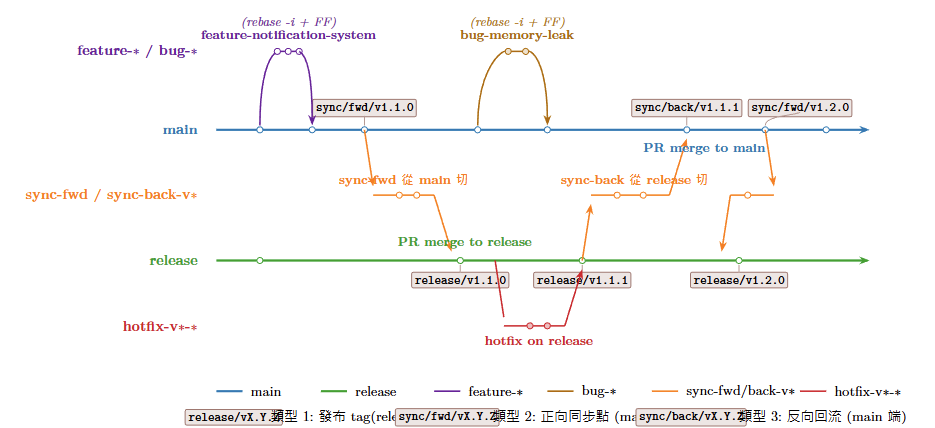

> 圖中:`main` 上方為短期功能/缺陷分支(feature-* / bug-*),下方為 `sync-fwd / sync-back` 同步暫存分支,最下方為 `release` 分支與 `hotfix-v*-*`。同步事件以 tag 標示(`release/v*` 與 `sync/fwd/v*` 在 release 端 PR-merge commit 上;`sync/back/v*` 在 main 端 PR-merge commit 上)。

> ⚠️ **核心鐵則 — 所有分支間的合併皆透過 GitHub Pull Request 完成**
> 不論是 `feature-* / bug-* → main`、`hotfix-v*-* → release`、`sync-fwd-v* → release`、`sync-back-v* → main`,**一律走 PR**。本地**不執行** `git merge` 至長期分支;sync 分支上**亦不做本地 merge / rebase**,僅作為 PR 載具。整合動作只由 Release Owner 在 GitHub 介面上按「**Create a merge commit**」按鈕完成。

- **`main`** — 長期主幹,所有 feature/bug 在這裡完成整合。
- **`release`** — 長期發佈線,只接受兩種來源:
  1. 從 `main` 切出的 `sync-fwd-v<X.Y.Z>` 經 **PR + Create a merge commit** 同步進來;
  2. 從 `release` 拉出的 `hotfix-v<X.Y.Z>-<name>` 修完 **PR** 回來。
- **同步方向永遠是雙向的**:`main → release`(正向)與 `release → main`(反向),兩端皆以 **PR + Create a merge commit** 推進。
- **歷史結構**:長期分支包含 PR 產生之 merge commit(非純線性);日常以 `git log --first-parent` 觀察主線視圖,merge commit 之 `parent[0]` 由 PR 機制自動保證為目標長期分支,使主線歷史不被污染。

---

## 2. 命名與訊息規範(分支 / Tag / Commit message)

### 2.1 分支

| 分支 | 命名 | 來源 | 終點 | Commit type | 生命週期 |
|---|---|---|---|---|---|
| 主幹 | `main` | — | — | — | 長期 |
| 發佈線 | `release` | — | — | — | 長期 |
| 新功能 | `feature-<精簡說明>` | `main` | PR-merge 進 `main` | `[feat]` | 短期 |
| 缺陷修正 | `bug-<精簡說明>` | `main` | PR-merge 進 `main` | `[fix]` | 短期 |
| 內部重構 | `refactor-<精簡說明>` | `main` | PR-merge 進 `main` | `[refactor]` | 短期 |
| 測試補強 | `test-<精簡說明>` | `main` | PR-merge 進 `main` | `[test]` | 短期 |
| 雜項維護 | `chore-<精簡說明>` | `main` | PR-merge 進 `main` | `[chore]` | 短期 |
| 正向同步暫存 | `sync-fwd-v<X.Y.Z>` | `main` | PR-merge 進 `release`(Create a merge commit) | — | 一次性 |
| 反向同步暫存 | `sync-back-v<X.Y.Z>` | `release` | PR-merge 進 `main`(Create a merge commit) | — | 一次性 |
| 緊急修正 | `hotfix-v<X.Y.Z>-<精簡說明>` | `release` | PR-merge 進 `release`,並由 `sync-back-v<X.Y.Z>` 回流 `main` | `[fix]` | 短期 |

> **分支類型補充說明**:
> - **`refactor-*`**:內部結構調整,**不改變對外行為**(無新功能、無 bug 修正)。Reviewer 焦點為「對外行為是否真的沒變」。範例:`refactor-config-loader`、`refactor-auth-module`。
> - **`test-*`**:僅新增或修改測試碼,**不動產品程式碼**。常用於補測試覆蓋率、加 regression test。範例:`test-add-integration-suite`、`test-coverage-auth`。
> - **`chore-*`**:雜項維護——相依套件升級、build / CI 設定、檔案搬移、版本號 bump 等,**不影響產品邏輯**。範例:`chore-bump-deps`、`chore-update-cicd`、`chore-cleanup-build-scripts`。
> - 上述三類整合流程與 `feature-*` / `bug-*` 完全相同(短期分支 → PR-merge 進 `main`),merge 方式採 `Rebase and merge` 或 `Squash and merge`(紀律 2 對短期分支不設限,僅 sync-* 必須用 `Create a merge commit`)。
> - 整合測試強度視類型而定:`refactor-*` 須完整跑(重構最易破壞行為);`chore-*` 視範圍而定(動 build 設定要全跑,僅升次要套件可較輕);`test-*` 通常只需驗證新測試本身可靠執行。

### 2.2 Tag

| Tag | 用途 | 打在 | 是否升 GitHub Release |
|---|---|---|---|
| `release/v<X.Y.Z>` | 對外發佈版本錨點 | **release 端** PR-merge commit | ✅ 是 |
| `sync/fwd/v<X.Y.Z>` | 正向同步事件錨點 | **release 端** PR-merge commit(與 `release/v*` 同一 commit) | ❌ 否 |
| `sync/back/v<X.Y.Z>` | 反向同步事件錨點 | **main 端** PR-merge commit | ❌ 否 |

> **Tag 放置原則(v2.0)**:
> - `release/v*` 與 `sync/fwd/v*` 同時打在 release 端的 PR-merge commit 上(同一 commit、不同語意 tag)。
> - `sync/back/v*` 打在 main 端的 PR-merge commit 上(反向回流落地點)。
> - 每個 PR-merge commit 之 `parent[1]` 直接指向同步來源(sync 分支 HEAD),提供完整的「兩分支歷史交會點」追溯能力;無需 patch-id 或 commit message 對照。
> - tag 之主要角色為「人類可讀」與「PM / 客服溝通用版本識別」;機制層面追溯由 git merge commit 的 parent 關係自動處理。

> 💡 **改進建議 — 簡化 tag 機制(本 PR 提案)**
>
> 目前同一版本需打 2–3 個 tag(`release/v*` 與 `sync/fwd/v*` 同 commit、`sync/back/v*` 在 main 端),語意分工細,但維運紀律負擔不小——需確保兩端都打齊(§7 Phase C、§8.2 Phase C),易漏。
>
> 上一段已自承「機制層面追溯由 git merge commit 的 parent 關係自動處理」,意即 `sync/fwd/v*` 與 `sync/back/v*` **對機器而言是冗餘的**——其資訊已存在於 PR-merge commit 的雙 parent 結構中。且 `release/` 前綴本身只是為了與 `sync/*` 區分;同步 tag 移除後,前綴也失去用途——「v1.1.0」就是 `v1.1.0`,無需再加任何 namespace。
>
> **建議**:每個版本只打 **一個** tag,命名為 `v<X.Y.Z>`(例:`v1.1.0`、`v1.1.1`、`v1.2.0`),作為對內/對外統一的版本錨點;同步事件純粹靠 PR-merge commit 的 `parent[1]` 追溯,不再額外打 tag。對應需修改:
> - §2.2 tag 表格 → 簡化為一列 `v<X.Y.Z>`,刪除 `release/v*` / `sync/fwd/v*` / `sync/back/v*`
> - §6、§7 Phase C、§8.1 Phase C、§8.2 Phase C 的打 tag / push 指令改用 `v<X.Y.Z>`,並移除 sync 打 tag 步驟
> - §10 checklist 的 tag 項目簡化為「`v<X.Y.Z>` 已打」
>
> 每個 `v<X.Y.Z>` tag 對應一次 GitHub Release(§6 流程不變),既是版本錨點也是對外發布識別點。

### 2.3 Commit message

每筆 commit message **一律以英文撰寫**,格式如下:

```
[屬性] 意圖描述(說明「為什麼改」)
------------------------------------------------------------

- 條列「改了什麼、做了什麼」(模組級,不列函式細節)
- 共 3–6 行為佳,最多不超過 10 行
```

| 項目 | 規則 |
|---|---|
| **屬性** | `[feat]` / `[fix]` / `[refactor]` / `[docs]` / `[test]` / `[chore]` / `[style]` / `[perf]`(**一律小寫**) |
| **描述大小寫** | 描述內容**首字母大寫**(`[feat] Support ...`,非 `[feat] support ...`) |
| **標題長度** | ≤ 72 字(含 `[屬性]`) |
| **分隔線** | 標題下一行緊接 60 個 `-`,再空一行寫 body |
| **語意分工** | **標題寫意圖/為什麼**,body 寫**改了什麼**;不要只寫 `Update X`、`Change Y` 這類純動作 |

type | 語意定義
-- | --
[feat] | 對外可見之新功能;改變使用者或呼叫方可觀察到的行為。
[fix] | 修正 bug;對外行為與預期不符之修補。Hotfix 一律使用此 type。
[refactor] | 內部結構調整,不改變對外行為(無新功能、無 bug 修正)。
[perf] | 效能優化,不改變對外行為(若同時新增功能應拆為 [feat] commit)。
[docs] | 僅變更文件、註解、README,不動產品程式碼。
[test] | 僅新增或修改測試碼,不動產品程式碼。
[style] | 程式碼格式調整(空白、縮排、formatter 套用),不改任何邏輯。
[chore] | 上述皆非之雜項(版本號、相依套件、CI 與建置設定、檔案搬移)。

**範例**:

```
[feat] Support cross-subdomain SSO login
------------------------------------------------------------

- Replace session-based auth with OAuth2 authorization-code flow.
- Add /oauth/callback endpoint and update User model schema.
- Bridge existing sessions on first login.
```

---

## 3. 六大紀律

1. **禁止直接改寫 `main` / `release` 歷史** — 不對長期分支執行任何 `git rebase`、`commit --amend`、`push --force` 或 `tag -f`。所有整合動作透過 sync / 短期分支與 PR 完成。
2. **雙向同步 PR 必用「Create a merge commit」** — sync-fwd / sync-back 之 PR 合併按鈕**僅允許** GitHub 的「Create a merge commit」選項;**禁用** Squash merge(會破壞雙 parent 結構)與 Rebase merge(會改寫 SHA 造成雙胞胎)。GitHub repo 設定應僅勾選 `Allow merge commits`,停用其餘兩個選項以防誤按。
3. **Hotfix 不得累積** — 一個 `hotfix-v<X.Y.Z>-<name>` 對應一次 release,打完 `release/v*` tag 後**立即**啟動 `sync-back-v*` 回流 `main`,於下一個 hotfix 開立前完成。
4. **Hotfix 為衝突解決之權威來源** — `sync-back-*` 與 `main` 衝突時,於 sync 分支本地解衝突,**一律以 release 上之 hotfix 為主**;main 上之既有實作雖意圖相近,但未經 production 驗證,需被覆蓋。
5. **短期分支整合原則** — `feature-*` / `bug-*` / `hotfix-*` 在 PR-merge 前必須完成 `rebase -i` 整理 + 完整整合測試;`sync-fwd-*` / `sync-back-*` 不做本地 merge / rebase,但 PR CI 必須對「合併後狀態」完整測試。
6. **PR 必附測試紀錄** — 任何進到 `main` 或 `release` 的 PR,**必須在 PR description 附上對應的測試紀錄**(編譯結果、單元測試輸出、整合測試報告、實機驗證截圖等,視變更性質而定)。缺測試紀錄者,Reviewer 直接 `Request changes`,Release Owner 不予 merge。CI 上線前,此為唯一的品質防線。

---

## 4. 專案初始化(Step 1–4)

### Step 1 — 建立 Repository

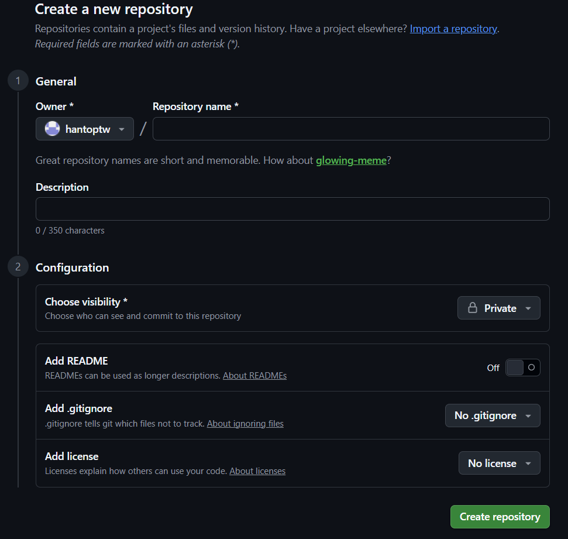

- 由 **Repo Owner** 在 GitHub Organization(`hantoptw`)下 `New repository`
:`ipc-firmware`、`ipc-sdk`)
- 勾選 `Initialize this repository with a README`
- 預設分支:**`main`**

### Step 2 — 建立 `release` 長期分支

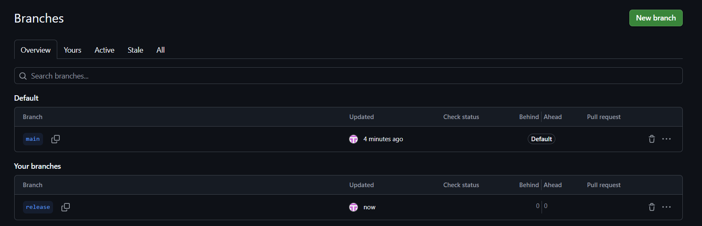

```bash
git clone git@github.com:hantoptw/<repo>.git
cd <repo>

# 切出 release 分支
git checkout -b release
git push -u origin release
```

到 GitHub `Settings → Branches → Branch protection rule`:
- 對 **`main`** 和 **`release`** 各建一條保護規則
- 勾選 `Require a pull request before merging`
- 勾選 `Require status checks to pass before merging`
- ⚠️ **不要勾選** `Require linear history`(v2.0 模型需要 PR-merge commit,勾此項會禁掉「Create a merge commit」按鈕)
- `Restrict who can push to matching branches` → 僅 Release Owner

並到 `Settings → General → Pull Requests`:
- ✅ 勾選 `Allow merge commits`(必需,v2.0 同步機制依賴此選項)
- ❌ **取消勾選** `Allow squash merging`(防誤按破壞 sync 之雙 parent 結構)
- ❌ **取消勾選** `Allow rebase merging`(防誤按造成 SHA 雙胞胎)
- ✅ 勾選 `Automatically delete head branches`(PR-merge 後自動刪除短期/sync 分支)

> **特例**:若團隊強烈希望 feature/bug 短期分支用 Squash 進 main(commits 壓成一筆),可保留 `Allow squash merging`,但須於 PR template 與 Reviewer 紀律中明確規範:**sync-fwd-* / sync-back-* 之 PR 一律選 Create a merge commit**,違者 Release Owner 拒絕合併。

### Step 3 — 建立 Project(看板)

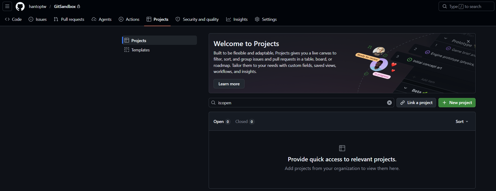

- 在 Organization 層級 `Projects → New project`
- 命名:`<repo> Roadmap`
- 範圍:Organization-level(可跨 repo 使用)

### Step 4 — 選 Roadmap 模板(非強制,依個人習慣)

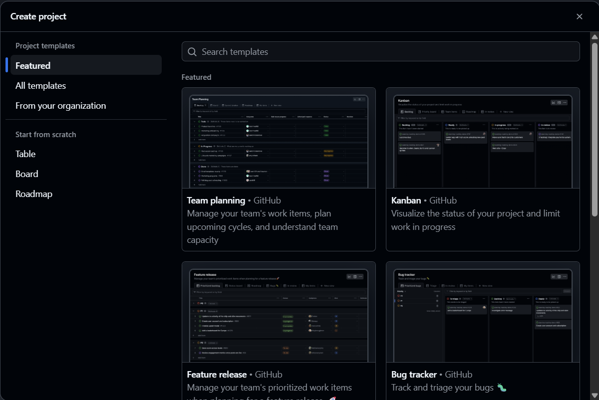

> 此步驟**非強制**。Project 模板選擇純屬個人/團隊喜好,可選 Roadmap、Kanban、Table、或不建 Project。以下為**建議設定**,僅供參考:

- 選 **Roadmap** template(時間軸視圖)
- 設定欄位:
  - `Status`:`Todo` / `In Progress` / `In Review` / `Done`
  - `Milestone`:對應版本(`v1.1.0`、`v1.1.1` ...)
  - `Iteration`(可選):雙週迭代

---

## 5. 日常開發流程

### Step 5 — 建立 Issue

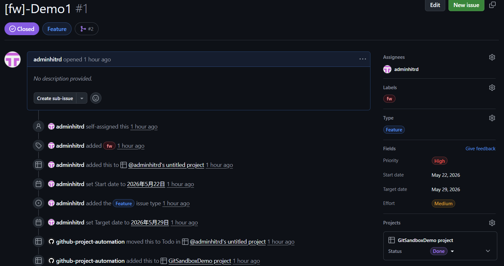

- 在 repo `Issues → New issue` 描述工作內容
- 必填:
  - **Title**:簡短描述
  - **Description**:What / Why / Acceptance Criteria
  - **Labels**:`feature` / `bug` / `hotfix` 擇一
  - **Milestone**:目標版本
  - **Assignees**:負責開發者

### Step 6 — Issue 自動連結 Project

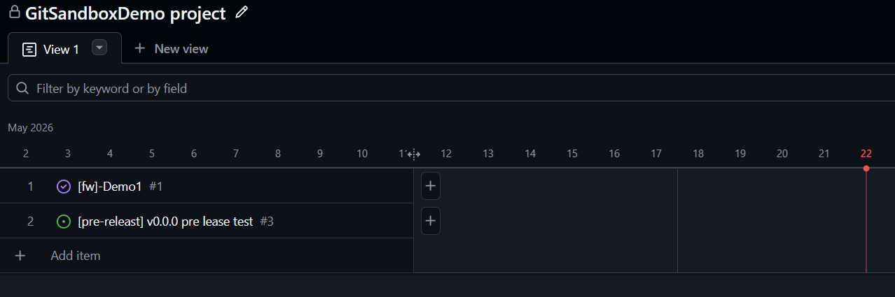

- 若 repo 已加入 Project,新 Issue 會自動出現在 Project 看板
- 開發者可把 Issue 拖到 `In Progress`

### 對應本地 Git 操作 — 切短期分支

```bash
git checkout main
git pull --ff-only origin main

# Feature
git checkout -b feature-notification-system
# 或 Bug
git checkout -b bug-memory-leak
# 或 Hotfix(從 release)
git checkout release
git pull --ff-only origin release
git checkout -b hotfix-v1.1.0-crash-on-boot
```

開發過程多次 commit 沒關係,FF 回去前會用 `rebase -i` 整理。Commit message 格式見 [§2.3](#23-commit-message)。

### Step 7 — 建立 Pull Request

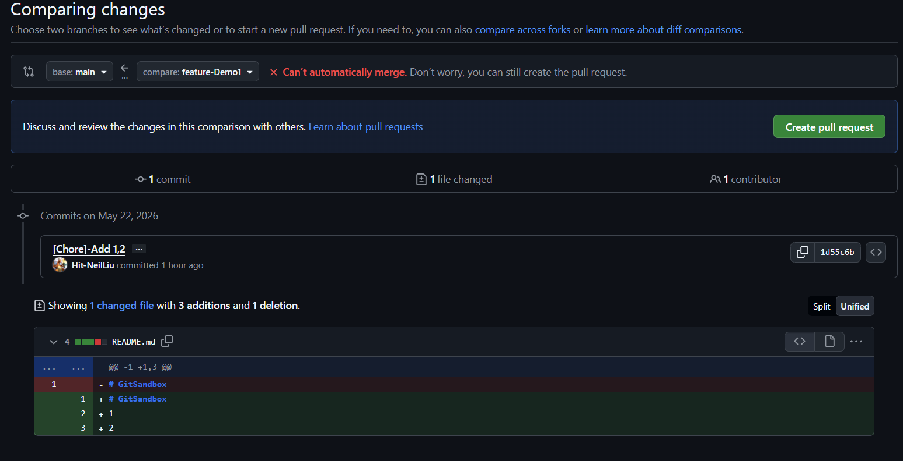

整理 commit 後推上去:

```bash
# 先在本地用 rebase -i 整理成乾淨的 commit 序列
git rebase -i main          # feature/bug 分支
git rebase -i release       # hotfix 分支

# 再對齊最新 main / release(避免落後)
git pull --rebase origin main

# 推送
git push -u origin feature-notification-system
```

到 GitHub 點 `Compare & pull request`:
- **base**:`main`(feature/bug)或 `release`(hotfix)
- **compare**:你的短期分支
- **Title**:跟 Issue 對齊,例如 `feat: notification system (#42)`
- **Description**:`Closes #42`(讓 Issue 自動關閉)
- 連結到 Project + Milestone

### Step 8 — 指定 Code Reviewer

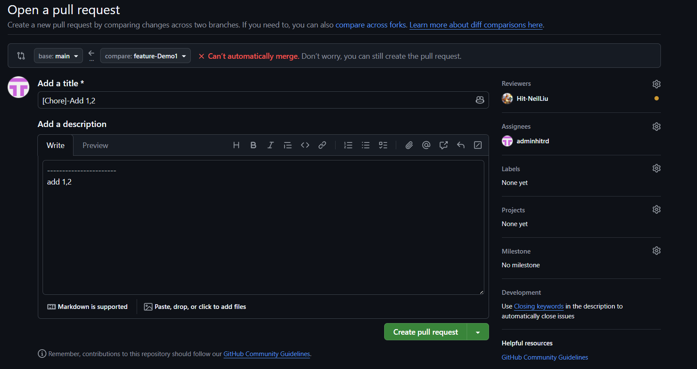

- 右側 `Reviewers` 指派至少一位 reviewer(可由 **CODEOWNERS** 自動指派)
- `Assignees` 指派自己
- `Projects` / `Milestone` / `Labels` 確認

### Step 9 — Reviewer 審查

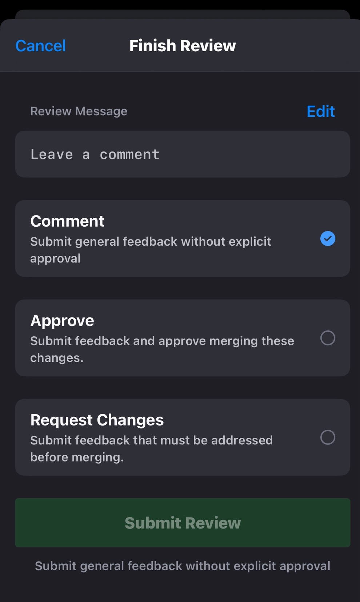

- Reviewer 用 `Files changed → Review changes`
- 三種狀態:`Comment` / `Approve` / `Request changes`
- 開發者依 comment 補 commit(完成後再 `rebase -i` squash 進對應的原始 commit)

### Step 10 — CI 檢查通過(目前無CI流程，先由人工審查)

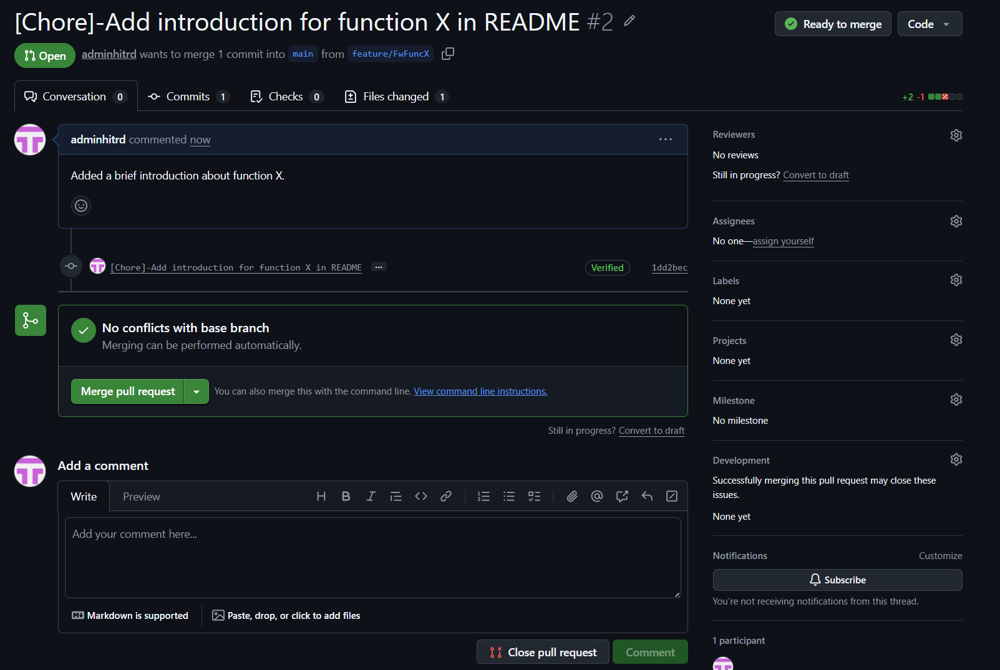

- GitHub Actions 跑完所有 `Required status checks`(編譯、單元測試、lint、整合測試)
- **必須全綠**才可以 merge
- 對應紀律 5:**短期分支整合測試是 FF 前的必要條件**

> ⚠️ **現況說明 — 目前尚未建立 CI 自動化**
> 本專案暫無 GitHub Actions / Jenkins 等自動化檢查,Step 10 所列的編譯、單元測試、lint、整合測試**均仰賴開發者本機完成**。在 CI 上線之前,**main / release 的品質完全取決於團隊的工作習慣**,請所有成員共同遵守:
> - **發 PR 前**:本機完成 `編譯 → 單元測試 → 整合測試` 三段驗證,並把結果(指令輸出、測試報告)貼到 PR description。
> - **Review 時**:Reviewer 不只看 diff,也要檢查 PR description 是否附測試證據。
> - **Merge 前**:Release Owner 確認 PR 上已有測試證據與 Reviewer Approve,缺一不可 merge。
>
> CI pipeline 建置完成後,此段將改為「**Required status checks 全綠才可 merge**」的強制門檻,請持續關注。

### Step 11 — Merge,Issue 自動關閉

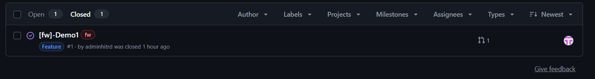

由 **Release Owner**(或具備 merge 權限的 maintainer)按 merge:

| 分支類型 | 必選 Merge 方式 | 說明 |
|---|---|---|
| 短期分支 → 長期分支<br>(`feature-*` / `bug-*` / `refactor-*` / `test-*` / `chore-*` / `hotfix-*`) | **Rebase and merge** 或 **Squash and merge** | 短期分支已 `rebase -i` 整理,進主幹保持乾淨歷史。Squash 適用於 commit 凌亂或希望壓成單筆。 |
| `sync-fwd-v*` → `release` | **Create a merge commit**(僅此選項) | sync 必須產生雙 parent 之 merge commit,作為 sync 事件錨點與 tag 對應點。 |
| `sync-back-v*` → `main` | **Create a merge commit**(僅此選項) | 同上;`parent[0]` 由 PR 機制保證為 main HEAD,主線 `--first-parent` 視圖保持乾淨。 |

> ⚠️ **嚴禁** sync-fwd / sync-back PR 使用 Squash 或 Rebase merge:
> - Squash 破壞雙 parent 結構,使 sync/fwd 與 sync/back tag 失去追溯能力;
> - Rebase 改寫 commit SHA,造成雙胞胎 commit,引入 v1.0 之 Q3 重複衝突風險。
>
> 建議由 Repo Owner 在 `Settings → General → Pull Requests` 中**僅勾選** `Allow merge commits`,從工具層面強制。若團隊保留 Squash 給短期分支用,則須以人工紀律守住 sync 之選項。

合併後:
- 短期分支自動刪除(若勾了 `Automatically delete head branches`)
- PR description 寫的 `Closes #42` 會自動關閉對應 Issue
- Project 上的卡片自動移到 `Done`

### 對應本地 Git 操作 — 同步主幹

```bash
git checkout main
git pull --ff-only origin main
git branch -d feature-notification-system   # 本地清理
```

---

## 6. 發佈版本(Step 12)

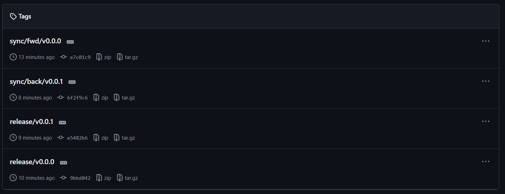

當 `release` 分支累積到一個發佈點(通常完成一輪 `sync-fwd-v<X.Y.Z>`):

```bash
git checkout release
git pull --ff-only origin release

# 打對外發佈 tag
git tag -a release/v1.1.0 -m "Release v1.1.0"
git push origin release/v1.1.0
```

到 GitHub `Releases → Draft a new release`:
- **Choose a tag** → `release/v1.1.0`(已存在)
- **Release title**:`v1.1.0`
- **Description** → 點 `Generate release notes` 自動產 changelog
- 上傳產出物(韌體 bin / SDK zip / 安裝包)
- 按 `Publish release`

> 內部追溯用的 `sync/fwd/v*`、`sync/back/v*`、`release/forked` **只 push tag,不發 Release**。

---

## 7. 正向同步:main → release

> **時機**:`main` 累積一定 feature 後,要把進度推進到 `release` 分支準備出版。
> **發起者**:Release Owner(或被授權的同步負責人)。

### Phase A — 本地準備(從 main 切 sync-fwd,不做本地 merge / rebase)

```bash
# 1. 從 main 拉出 sync-fwd 同步分支
git checkout main
git pull --ff-only origin main
git checkout -b sync-fwd-v1.1.0

# 2. (可選)本地完整整合測試 — 詳見下方說明
#    sync-fwd 此刻內容即等同 main HEAD,可直接在此分支跑測試環境

# 3. 推上去等 PR
git push -u origin sync-fwd-v1.1.0
```

> ⚠️ **`sync-fwd-v<X.Y.Z>` 的整合測試務必完整**(紀律 5)
>
> `sync-fwd` 不是單一 feature 的合併,而是**把 main 上累積一整輪 feature/bug 一次同步進 release**,影響面遠大於日常 PR。整合測試**不可省略、不可只跑單元測試交差**。具體要求:
>
> - **編譯**:Debug / Release 兩個 build configuration 都要過。
> - **單元測試**:全套執行,通過率 100%。
> - **整合測試**:涵蓋本輪同步含括的**所有 feature/bug** 的端到端情境,以「合併後狀態」(sync-fwd + release 之合併結果)為測試對象。
> - **回歸測試**:跑過上一個 `release/v*` 的核心功能驗證,確認沒有把舊功能弄壞。
> - **測試證據**:把上述結果(log、截圖、測試報告)貼進 PR description,Reviewer 才能據此 Approve。
>
> 若任一項未通過,**禁止合併 PR**,先於 sync-fwd 分支(或 main)修正後重新發起。`sync-fwd` 一旦進 release,後續 hotfix 與發佈都會建立在這個基礎上,任何漏網 bug 的修正成本都會大幅放大。

### Phase B — 透過 PR 合併進 `release`(必用 Create a merge commit)

在 GitHub 開 Pull Request:

| PR 設定 | 值 |
|---|---|
| **base 分支** | `release` |
| **compare 分支** | `sync-fwd-v1.1.0` |
| **Title** | `[sync-fwd] release v1.1.0 from main` |
| **Description** | 列出本次同步含括的 feature/bug PR 編號;附整合測試紀錄(紀律 6) |
| **Merge 方式** | **Create a merge commit**(僅此選項,紀律 2) |

PR 開立後流程:
1. PR 平台 CI 自動測試「合併後狀態」(若 GitHub Actions 已設定 `pull_request` event)。
2. 若 PR 顯示衝突,於本地解決後 push:
   ```bash
   git checkout sync-fwd-v1.1.0
   git pull --rebase origin sync-fwd-v1.1.0
   git merge release    # 將 release 整入 sync-fwd 解衝突
   # 解衝突,git add && git commit
   git push origin sync-fwd-v1.1.0
   ```
3. Review + CI 全綠後,由 **Release Owner** 在 GitHub 按 **`Create a merge commit`** 按鈕。
4. **嚴禁** 按 Squash 或 Rebase merge(紀律 2)。

### Phase C — 打 tag(PR merge 完成後)

```bash
# 拉回 merge 後的最新 release(PR-merge commit 已落於 release HEAD)
git checkout release
git pull --ff-only origin release

# 在 release 端打發布 tag 與 sync-fwd tag(指向同一個 PR-merge commit)
git tag -a release/v1.1.0 -m "Release v1.1.0"
git tag -a sync/fwd/v1.1.0 -m "sync-fwd merge point for release v1.1.0"
git push origin release/v1.1.0 sync/fwd/v1.1.0

# 清理本地 sync 分支(遠端通常已由 GitHub 自動刪)
git branch -D sync-fwd-v1.1.0
```

> **Tag 放置原則(v2.0)**:`release/v*` 與 `sync/fwd/v*` 同時打在 release 端的 PR-merge commit 上(同一 commit、不同語意)。merge commit 的 `parent[1]` 直接指向 sync-fwd HEAD(= 同步當下 main HEAD),無需另在 main 端打 tag。
>
> 同步完成後若要對外發佈 GitHub Release,接 §6 流程。

---

## 8. Hotfix 與反向同步:release → main

> **時機**:已發佈版本出現 bug,需要在 `release` 上緊急修正,並回流 `main`。

### 8.1 Hotfix(`hotfix-v*-*` → `release`)

#### Phase A — 本地準備

```bash
# 1. 從 release 切 hotfix
git checkout release
git pull --ff-only origin release
git checkout -b hotfix-v1.1.0-crash-on-boot

# 2. 修正 + commit
git commit -am "fix: crash on boot when XXX"

# 3. rebase -i 整理成乾淨 commit
git rebase -i release

# 4. 再對齊一次 release(防止落後)
git pull --rebase origin release

# 5. 推上去
git push -u origin hotfix-v1.1.0-crash-on-boot
```

#### Phase B — 透過 PR 合併進 `release`(走 §5 Step 7–11)

| PR 設定 | 值 |
|---|---|
| **base 分支** | `release` |
| **compare 分支** | `hotfix-v1.1.0-crash-on-boot` |
| **Merge 方式** | **Rebase and merge**(或 **Squash and merge**,視 commit 數量) |

由 **Release Owner** 在 GitHub 按 merge。**本地不執行 `git merge`**。

#### Phase C — 打 release tag

```bash
git checkout release
git pull --ff-only origin release

git tag -a release/v1.1.1 -m "Hotfix release v1.1.1"
git push origin release/v1.1.1
```

→ 接 §6 在 GitHub 發佈 Release。

---

### 8.2 反向同步(`sync-back-v*` → `main`,紀律 3:hotfix 不得累積)

**打完 `release/v1.1.1` 後立刻啟動**。

#### Phase A — 本地準備(從 release 切 sync-back,不做本地 merge / rebase)

```bash
# 1. 從 release 拉出反向同步分支
git checkout release
git pull --ff-only origin release
git checkout -b sync-back-v1.1.1

# 2. (可選)本地整合測試
#    sync-back 此刻內容即等同 release HEAD(含 hotfix)

# 3. 推上去等 PR
git push -u origin sync-back-v1.1.1
```

#### Phase B — 透過 PR 合併進 `main`(必用 Create a merge commit)

| PR 設定 | 值 |
|---|---|
| **base 分支** | `main` |
| **compare 分支** | `sync-back-v1.1.1` |
| **Title** | `[sync-back] backport release v1.1.1 hotfix to main` |
| **Description** | 連結到 `release/v1.1.1` Release Notes;附整合測試紀錄(紀律 6) |
| **Merge 方式** | **Create a merge commit**(僅此選項,紀律 2) |

PR 開立後流程:
1. PR 平台 CI 自動測試「合併後狀態」(以 main 之測試集為準)。
2. 若 PR 顯示衝突,於本地解決後 push;**衝突取捨一律以 release 上之 hotfix 為主**(紀律 4):
   ```bash
   git checkout sync-back-v1.1.1
   git pull --rebase origin sync-back-v1.1.1
   git merge main    # 將 main 整入 sync-back 解衝突
   # 解衝突,以 hotfix 為權威 (紀律 4)
   # git checkout --ours <file>   (sync-back 上之內容即 release hotfix)
   # 或人工編輯,確保 hotfix 修補意圖保留
   git add <file>
   git commit
   git push origin sync-back-v1.1.1
   ```
3. Review + CI 全綠後,由 **Release Owner** 在 GitHub 按 **`Create a merge commit`** 按鈕。
4. **嚴禁** 按 Squash 或 Rebase merge(紀律 2)。

#### Phase C — 打 tag

```bash
# 拉回 merge 後的最新 main(PR-merge commit 已落於 main HEAD)
git checkout main
git pull --ff-only origin main

# 在 main 端打 sync/back tag(指向 PR-merge commit)
git tag -a sync/back/v1.1.1 -m "main commit synced back from release v1.1.1"
git push origin sync/back/v1.1.1

# 清理本地 sync 與 hotfix 分支
git branch -D sync-back-v1.1.1
git branch -D hotfix-v1.1.0-crash-on-boot   # 若本地還有
```

> **Tag 放置原則(v2.0)**:`sync/back/v*` 打在 **main 端 PR-merge commit** 上。
> merge commit 的 `parent[1]` 直接指向 release HEAD(= 同步當下的 release/v1.1.1),
> 完整保留「兩分支歷史交會點」之追溯,無需 patch-id 或 commit message 對照。

> ⚠️ **若 release 上含非 hotfix commit(版本號 bump、SKU patch、build flag 等)**,
> 直接 PR-merge 會將這些變更一併帶入 main。此時建議改用 cherry-pick 子流程:
> ```bash
> git checkout -b sync-back-v1.1.1 main      # 改從 main 切
> git cherry-pick <hotfix-sha-on-release>    # 只挑 hotfix
> git push -u origin sync-back-v1.1.1
> # 開 PR,base=main, head=sync-back-v1.1.1
> # 仍用 Create a merge commit
> ```
> 代價:hotfix 會出現雙 SHA(release 端原 SHA, main 端 cherry-pick 後新 SHA),
> 但此雙 SHA 為一次性、有界,不會引發 v1.0 之 Q3 重複衝突。

---

## 9. 角色與權限

| 角色 | 權限 | 職責 |
|---|---|---|
| **Repo Owner** | Admin | 建 repo、設定 branch protection、CODEOWNERS |
| **Release Owner** | Maintain | 唯一可 merge 進 `main` / `release` 的角色;打 `release/v*` tag;發 GitHub Release |
| **Developer** | Write | 建 feature/bug/hotfix 分支、發 PR、回應 review |
| **Reviewer** | Write | 審查 PR、Approve / Request changes |

GitHub 設定路徑:
- `Settings → Collaborators and teams` 設角色
- `Settings → Rules → Rulesets` 設 push/merge 限制(`Restrict updates` + Bypass list = Release Owner)

---

## 10. 建議-檢核清單(Checklist)-可依個人工作習慣或git 操作熟練度進行調整

### 開發者每次發 PR 前

- [ ] 本地已 `rebase -i` 整理成乾淨 commit
- [ ] 已 `git pull --rebase` 對齊最新 base 分支
- [ ] commit message 對應 Issue(`Closes #N`)
- [ ] **PR description 已附測試紀錄**(編譯 / 單元測試 / 整合測試,視變更性質;紀律 6)
- [ ] CI 在本地能跑過(可選)

### Reviewer 審查時

- [ ] **確認 PR description 含測試紀錄**(紀律 6;缺者直接 `Request changes`)
- [ ] 程式碼正確性、安全性、可讀性、測試覆蓋符合預期

### Release Owner 每次 merge 前(暫定)

- [ ] 所有 Required status checks 全綠
- [ ] 至少一位 Reviewer Approve
- [ ] **PR description 含測試紀錄**(紀律 6;缺者不予 merge)
- [ ] PR base 分支正確:
  - feature / bug → `main`
  - hotfix → `release`
  - **sync-fwd → `release`**
  - **sync-back → `main`**
- [ ] Merge 按鈕選擇正確:
  - **短期分支**(feature/bug/hotfix)→ `Rebase and merge` 或 `Squash and merge`
  - **sync-fwd / sync-back** → **`Create a merge commit`**(紀律 2,絕不選 Squash / Rebase)
- [ ] Hotfix merge 完後,**24 小時內**啟動 `sync-back-v<X.Y.Z>`(紀律 3)

### 同步完成後(暫定)

- [ ] tag 已打齊:
  - 正向同步:`release/v<X.Y.Z>` + `sync/fwd/v<X.Y.Z>`(兩者皆在 release 端,指向同一 PR-merge commit)
  - 反向同步:`sync/back/v<X.Y.Z>`(在 main 端,指向 PR-merge commit)
- [ ] 對外發佈版本已升 GitHub Release(若為 `release/v*`)
- [ ] Project 上對應卡片已移到 Done
- [ ] 短期分支與 sync 分支(local + remote)已刪除
